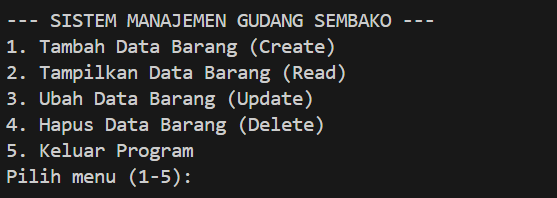
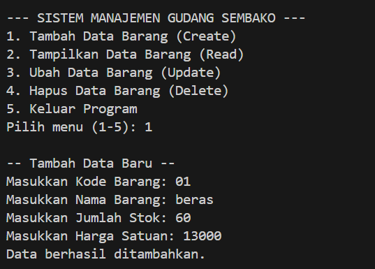
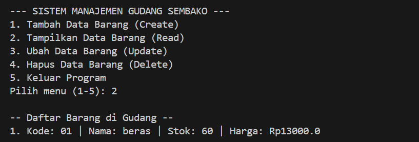
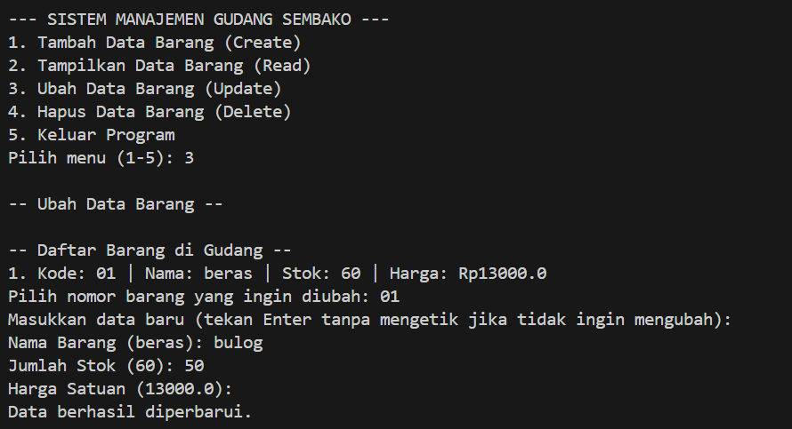
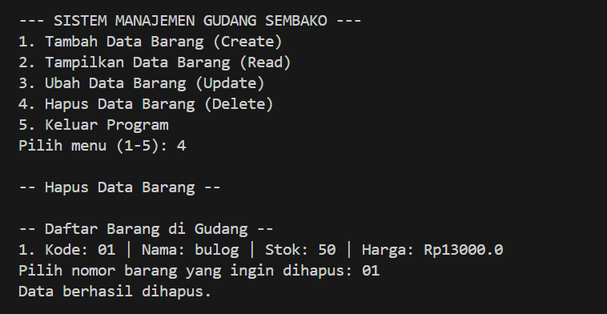

# Sistem Manajemen Gudang Sembako

Program aplikasi konsol berbasis Java untuk mengelola data stok barang (sembako) di dalam sebuah gudang. Program ini mengimplementasikan operasi dasar CRUD (Create, Read, Update, Delete) dan menyimpan data secara dinamis menggunakan struktur data `ArrayList`.

##  Fitur Program

Program ini memiliki menu interaktif yang berjalan terus-menerus hingga pengguna memilih untuk keluar. Fitur utama meliputi:
* **Create:** Menambahkan data barang baru (Kode, Nama, Jumlah Stok, Harga Satuan).
* **Read:** Menampilkan daftar seluruh barang yang tersimpan di dalam memori.
* **Update:** Mengubah data barang yang sudah ada berdasarkan nomor urut (mendukung pengubahan sebagian data tanpa menghapus data yang tidak diubah).
* **Delete:** Menghapus data barang dari memori berdasarkan nomor urut.

---

##  Screenshot Output Program

Berikut adalah tampilan antarmuka konsol untuk setiap fitur yang dijalankan:
### Menu Awal


### 1.Tambah Data (Create)


### 2. Tampilkan Data (Read)


### 3. Ubah Data (Update)


### 4. Hapus Data (Delete)


---

##  Persyaratan Sistem

Untuk menjalankan program ini, pastikan sistem Anda telah terinstal:
* **Java Development Kit (JDK)** versi 8 atau yang lebih baru.

##  Cara Menjalankan Program

1.  Simpan kode program ke dalam sebuah file bernama `App.java`.
2.  Buka terminal atau command prompt (CMD), lalu arahkan direktori ke lokasi file `App.java` disimpan.
3.  Kompilasi kode program dengan perintah berikut:
    ```bash
    javac App.java
    ```
4.  Jalankan program yang telah dikompilasi dengan perintah:
    ```bash
    java App
    ```

##  Struktur Kode

Program ini terdiri dari dua kelas utama di dalam satu file:
1.  `Sembako`: Merupakan kelas model (Blueprint) yang merepresentasikan entitas barang dengan atribut `kodeBarang`, `namaBarang`, `jumlahStok`, dan `hargaSatuan`. Kelas ini menggunakan prinsip enkapsulasi dengan _getter_ dan _setter_.
2.  `App`: Merupakan kelas utama yang berisi fungsi `main`, deklarasi `ArrayList` sebagai media penyimpanan sementara, `Scanner` untuk input pengguna, serta logika menu dan eksekusi operasi CRUD.

##  Catatan Tambahan

* Program ini menggunakan penyimpanan berbasis memori sementara (_volatile_). Artinya, semua data yang ditambahkan akan hilang ketika program ditutup (exit). 
* Jika diperlukan penyimpanan permanen, program dapat dikembangkan lebih lanjut dengan mengintegrasikannya ke basis data (seperti MySQL) atau penyimpanan berbasis file (TXT/CSV).

---
*Dibuat untuk keperluan simulasi manajemen data gudang menggunakan Java.*