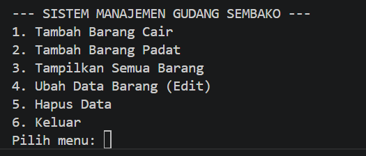
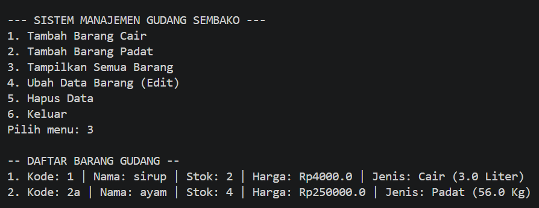
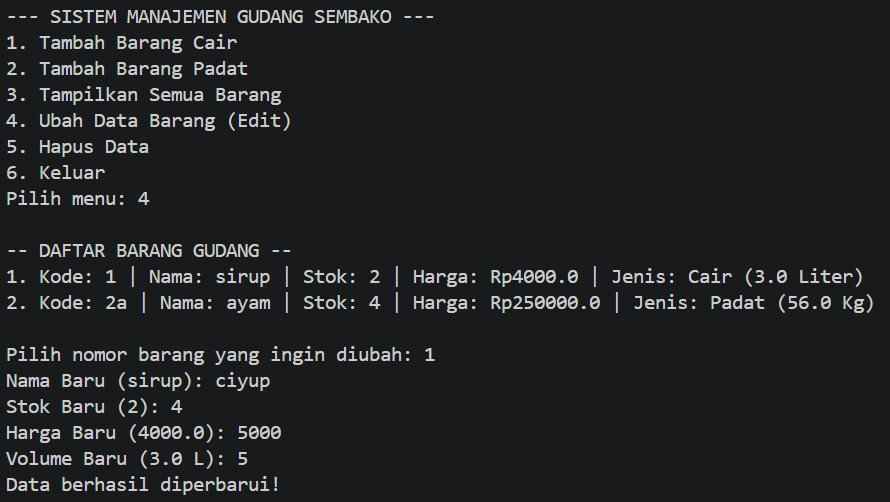
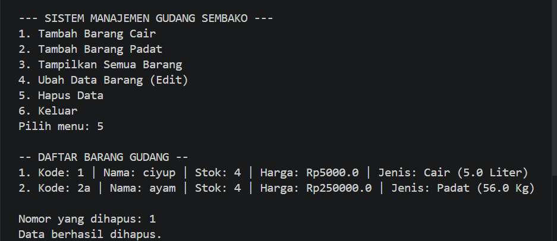

# Sistem Manajemen Gudang Sembako

Program aplikasi konsol berbasis Java untuk mengelola data stok barang sembako di dalam sebuah gudang. Program ini mengimplementasikan konsep Object-Oriented Programming (OOP) dan operasi dasar CRUD (Create, Read, Update, Delete) dengan penyimpanan data dinamis menggunakan `ArrayList`.

---

## Fitur Program

Program memiliki menu interaktif yang berjalan secara terus-menerus hingga pengguna memilih untuk keluar. Fitur utama meliputi:

- **Create:** Menambahkan data barang baru dengan dua jenis, yaitu barang cair (dengan atribut volume dalam liter) dan barang padat (dengan atribut berat dalam kilogram).
- **Read:** Menampilkan daftar seluruh barang yang tersimpan beserta detailnya.
- **Update:** Mengubah data barang yang sudah ada berdasarkan nomor urut, termasuk nama, stok, harga, serta atribut spesifik jenis barang.
- **Delete:** Menghapus data barang dari daftar berdasarkan nomor urut.

---

## Screenshot Output Program

Berikut adalah tampilan antarmuka konsol untuk setiap fitur yang dijalankan.

### Menu Utama


### 1. Tambah Data (Create)


### 2. Tampilkan Data (Read)


### 3. Ubah Data (Update)


### 4. Hapus Data (Delete)


---

## Persyaratan Sistem

Untuk menjalankan program ini, pastikan sistem Anda telah terinstal:

- **Java Development Kit (JDK)** versi 8 atau yang lebih baru.

---

## Cara Menjalankan Program

1. Simpan kode program ke dalam sebuah file bernama `App.java`.
2. Buka terminal atau command prompt, lalu arahkan direktori ke lokasi file `App.java` disimpan.
3. Kompilasi program dengan perintah berikut:
   ```bash
   javac App.java
   ```
4. Jalankan program yang telah dikompilasi:
   ```bash
   java App
   ```

---

## Struktur Kode

Program terdiri dari empat kelas yang berada dalam satu file `App.java`:

| Kelas | Tipe | Deskripsi |
|---|---|---|
| `Sembako` | Superclass | Kelas induk yang merepresentasikan entitas barang dengan atribut `kodeBarang`, `namaBarang`, `jumlahStok`, dan `hargaSatuan`. Menerapkan enkapsulasi melalui getter dan setter. |
| `SembakoCair` | Subclass | Mewarisi `Sembako` dan menambahkan atribut `volumeLiter`. Meng-override method `tampilkanInfo()`. |
| `SembakoPadat` | Subclass | Mewarisi `Sembako` dan menambahkan atribut `beratKg`. Meng-override method `tampilkanInfo()`. |
| `App` | Main Class | Kelas utama yang berisi method `main`, deklarasi `ArrayList` sebagai penyimpanan sementara, `Scanner` untuk input pengguna, serta seluruh logika menu dan operasi CRUD. |

### Konsep OOP yang Diterapkan

- **Encapsulation:** Atribut kelas `Sembako` bersifat `private` dan diakses melalui getter dan setter.
- **Inheritance:** `SembakoCair` dan `SembakoPadat` mewarisi atribut dan method dari kelas `Sembako`.
- **Polymorphism:** Method `tampilkanInfo()` di-override pada masing-masing subclass untuk menampilkan informasi spesifik sesuai jenisnya.
- **Type Checking:** Operator `instanceof` digunakan pada method `ubahData()` untuk menentukan tipe subclass saat runtime dan mengakses atribut spesifiknya.

---

## Catatan Tambahan

- Program menggunakan penyimpanan berbasis memori sementara. Semua data yang ditambahkan akan hilang ketika program ditutup.
- Untuk kebutuhan penyimpanan permanen, program dapat dikembangkan dengan mengintegrasikan basis data seperti MySQL atau penyimpanan berbasis file (TXT/CSV).