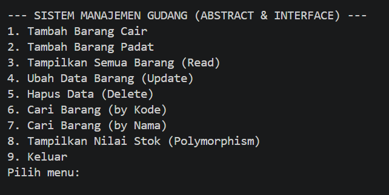
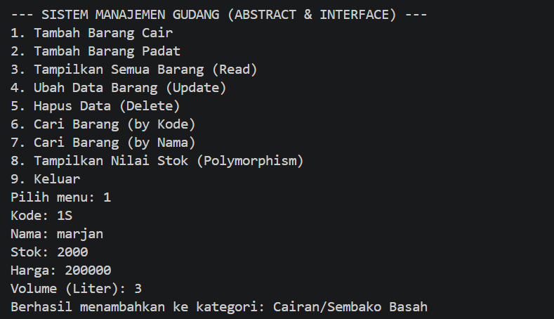
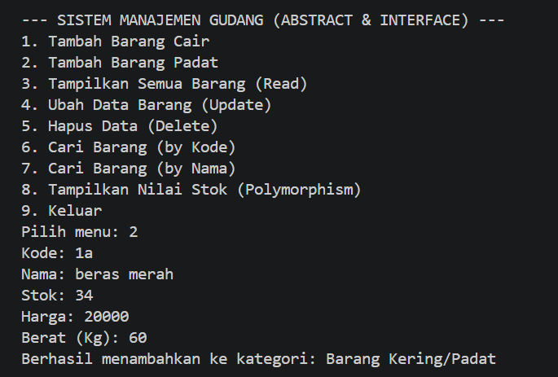
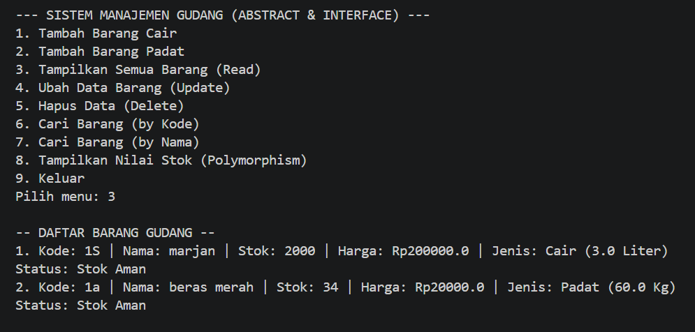
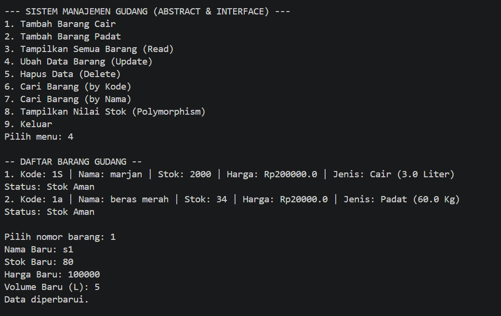
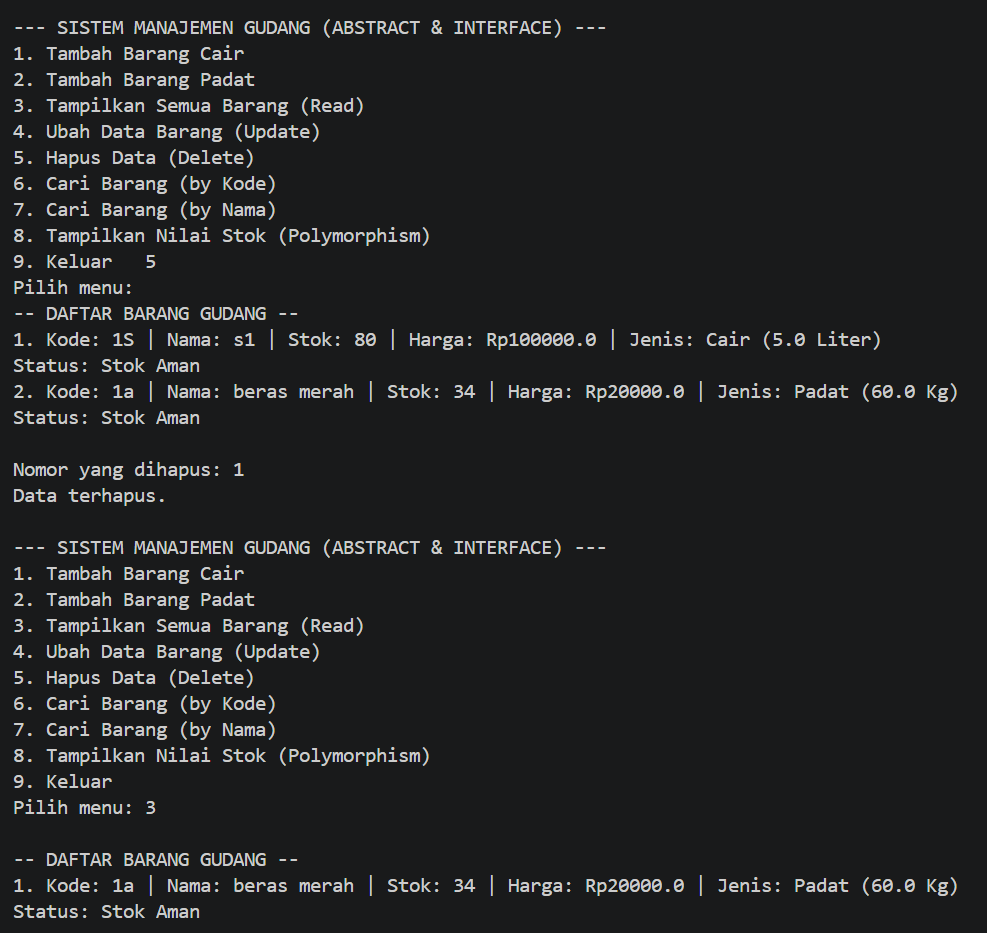
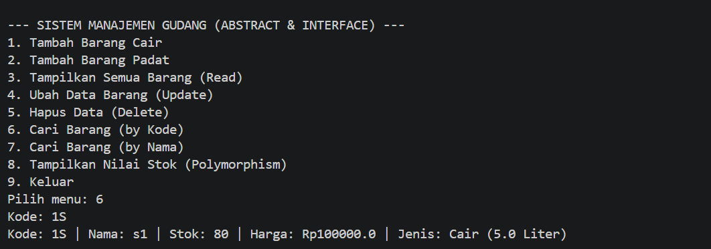
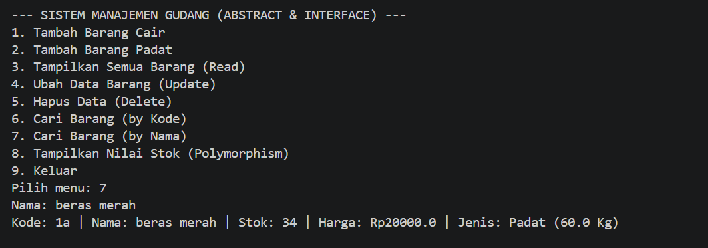

# Laporan Proyek: Sistem Manajemen Gudang Sembako (Abstract & Interface)

Program ini adalah aplikasi manajemen inventaris berbasis konsol yang dikembangkan menggunakan bahasa pemrograman Java. Aplikasi ini dirancang untuk mengelola stok gudang dengan menerapkan prinsip **Pemrograman Berorientasi Objek (PBO)** tingkat lanjut guna memastikan kode yang modular, aman, dan mudah dikembangkan.

## Deskripsi Program

Aplikasi ini mengelola dua kategori utama barang sembako, yaitu **Sembako Cair** dan **Sembako Padat**. Program menggunakan struktur data `ArrayList` untuk penyimpanan dinamis dan mendukung operasi CRUD (Create, Read, Update, Delete) serta fitur pencarian tingkat lanjut.

### Pilar PBO yang Diterapkan:

1.  **Abstract Class (`Sembako`)**: Berfungsi sebagai *blueprint* utama yang tidak dapat diinstansiasi langsung. Memiliki *abstract method* `getUnit()` yang mewajibkan setiap subclass menentukan satuan ukuran masing-masing (Liter atau Kg).
2.  **Interface (`ManajemenBarang`)**: Menyediakan kontrak standar operasional gudang melalui metode `cekKetersediaan()` untuk memantau level stok dan `getKategori()` untuk identifikasi jenis barang.
3.  **Inheritance & Polymorphism**: 
    * **Inheritance**: Subclass mewarisi seluruh atribut dan metode dari kelas `Sembako`.
    * **Polymorphism**: Metode `hitungNilaiStok()` berperilaku berbeda pada tiap subclass; Barang Cair ditambah biaya penanganan 5%, sedangkan Barang Padat dikurangi diskon penyimpanan 3%.
4.  **Encapsulation**: Melindungi integritas data dengan menggunakan akses `private` pada variabel dan menyediakan `Getter` serta `Setter`.

---

## Dokumentasi Fitur dan Output

Berikut adalah penjelasan setiap menu beserta tampilan output program:

### 1. Menu Utama
Antarmuka interaktif yang menyediakan 9 opsi navigasi untuk manajemen gudang.


### 2. Tambah Data (Create)
Pengguna dapat menambahkan barang sesuai kategorinya. Program akan memberikan konfirmasi kategori setelah data berhasil disimpan.
* **Tambah Barang Cair**: Memasukkan detail termasuk volume dalam Liter.
    
* **Tambah Barang Padat**: Memasukkan detail termasuk berat dalam Kg.
    

### 3. Tampilkan Data (Read)
Menampilkan seluruh daftar barang. Menu ini secara otomatis memicu metode interface untuk menampilkan **Status Stok** (Aman/Menipis).


### 4. Ubah Data (Update)
Memperbarui informasi barang yang ada. Program menggunakan *downcasting* untuk memastikan atribut unik (Volume/Berat) dapat diedit sesuai tipenya.


### 5. Hapus Data (Delete)
Menghilangkan data barang dari memori berdasarkan nomor urut yang dipilih oleh pengguna.


### 6. Pencarian (Search)
Fitur pencarian ganda untuk efisiensi pelacakan:
* **Berdasarkan Kode**: Pencarian spesifik menggunakan kode unik.
    
* **Berdasarkan Nama**: Pencarian menggunakan kata kunci (mendukung kecocokan sebagian nama).
    

### 7. Laporan Nilai Stok (Polymorphism)
Menghitung nilai finansial total aset gudang berdasarkan aturan perhitungan polimorfisme (biaya penanganan vs diskon).

---

## Cara Menjalankan Program

1.  Pastikan perangkat Anda telah terinstal **JDK 8** atau versi yang lebih baru.
2.  Simpan seluruh kode program ke dalam file bernama `Main.java`.
3.  Buka terminal/CMD dan arahkan ke folder penyimpanan file tersebut.
4.  Kompilasi program:
    ```bash
    javac Main.java
    ```
5.  Jalankan program:
    ```bash
    java Main
    ```

## Catatan Tambahan
* **Data Volatile**: Penyimpanan bersifat sementara di dalam RAM. Data akan hilang jika program dihentikan.
* **Indikator Stok**: Melalui *interface*, program akan otomatis memberikan peringatan stok menipis jika jumlah barang berada di bawah atau sama dengan 10 unit.

---